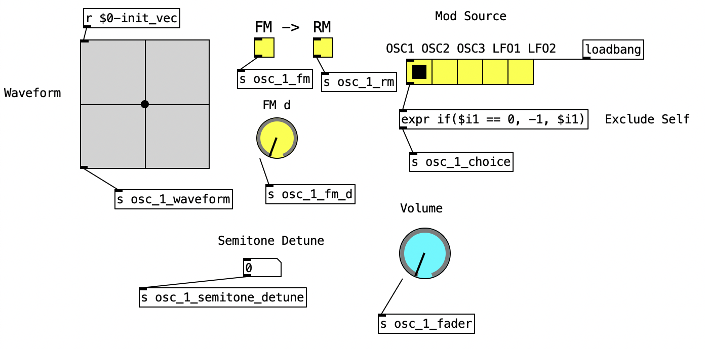
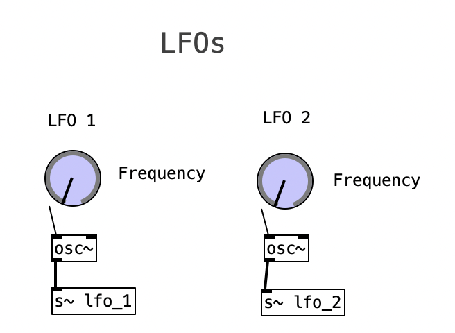
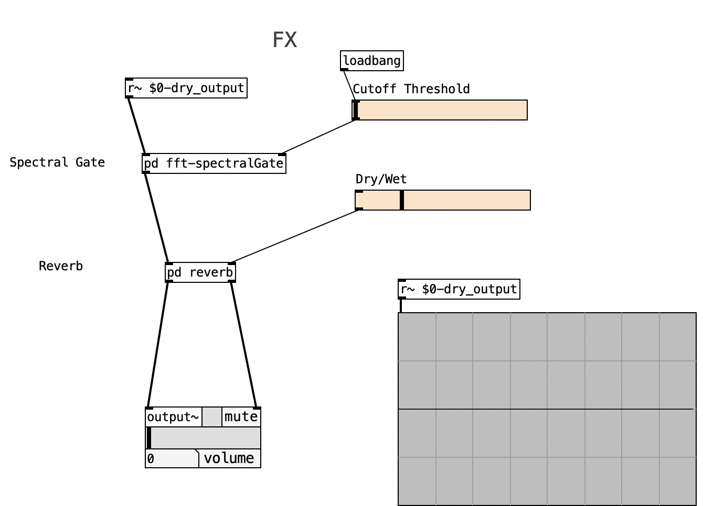

<html><head><meta content="text/html; charset=UTF-8" http-equiv="content-type"></head><body style="background-color:#FFFFFF;" class="c21 doc-content">
Digital Polyphonic Synthesizer

<h1 class="c14" id="h.oev555f95pwz">Introduction</h1>

The developed synthesizer includes:
<ul class="c0 lst-kix_zaanaadxqf06-0 start"><li class="c2 c4 li-bullet-0">3 oscillators, each featuring vector synthesis&nbsp;(for the definition of the waveform);</li><li class="c2 c4 li-bullet-0">An ADSR envelope;</li><li class="c2 c4 li-bullet-0">16 voices&nbsp;for the 3 oscillators;</li><li class="c2 c4 li-bullet-0">2 LFOs;</li><li class="c2 c4 li-bullet-0">FM&nbsp;and RM modulation (processed sequentially: FM &rarr; RM)&nbsp;for each oscillator;</li><li class="c2 c4 li-bullet-0">An effects section which includes spectral gating&nbsp;and reverb.</li></ul><h1 class="c2 c8" id="h.zd53lp9yckcg"></h1><h1 class="c2 c17" id="h.s49xd6f04y09">Implementation</h1><ul class="c0 lst-kix_68ngp6j5o2i7-0 start"><li class="c2 c4 li-bullet-0">Each of the 3 oscillators looks like this:</li></ul>

<ul class="c0 lst-kix_kzqr5gndgttl-0 start"><li class="c2 c4 li-bullet-0">The 16-voice polyphony happens to an abstraction named oscillators. This abstraction generates the signal for each of the 3 oscillators and applies the ADSR envelope before sending the output to its [outlet~]. Their parameters are global.</li><li class="c2 c4 li-bullet-0">The 2 LFOs are simply sine oscillators with a frequency knob:</li></ul>

<ul class="c0 lst-kix_olnjc5p1yfh6-0 start"><li class="c2 c4 li-bullet-0">Then, generating the signal for each oscillator, if the FM, RM or both toggles are enabled, the respective modulation is computed based on the selected source. The modulation source can be one of the following: the other 2 oscillators (pre-fader) or the 2 LFOs. If both FM and RM are enabled, they are computed sequentially (FM &rarr; RM).</li><li class="c2 c4 li-bullet-0">Finally, an effects section receives the multiple voices as a single input. The effects included are spectral gating - frequency components above a certain threshold are removed - and reverb - a mixture between dry and wet signals based on a value provided by the user:</li></ul>

<h1 class="c14" id="h.h14bxmpbctpk">Conclusions/Drawbacks</h1><ul class="c0 lst-kix_1yadyxhfjwcb-0 start"><li class="c2 c4 li-bullet-0">The synthesizer can generate a plethora of sounds with different levels of complexity and &ldquo;aggressiveness&rdquo;. Because of how accessible modulation (FM, RM or both) is, it is easier to achieve more &ldquo;aggressive&rdquo; and dissonant sounds.</li><li class="c2 c4 li-bullet-0">Regarding the development, implementing polyphony took a lot of work. By trying to fix a given problem, another one would arise. The synthesizer started as monophonic, and after most features were implemented, it was turned into polyphonic. In retrospect, starting with implementing a polyphonic synth and developing more features from there, could potentially result in a smoother development experience.</li><li class="c2 c4 li-bullet-0">Performance-wise, the patch can be further optimised: </li></ul><ul class="c0 lst-kix_1yadyxhfjwcb-1 start"><li class="c2 c3 li-bullet-0">Even when modulation (FM, RM) is disabled, they are still computed and later discarded. This also happens with the oscillators when their faders are set to 0. Ideally, they should not be processed at all.</li><li class="c2 c3 li-bullet-0">The latency is too high and not ideal for real-time performances. The issue mentioned above may be the culprit.</li></ul></body></html>